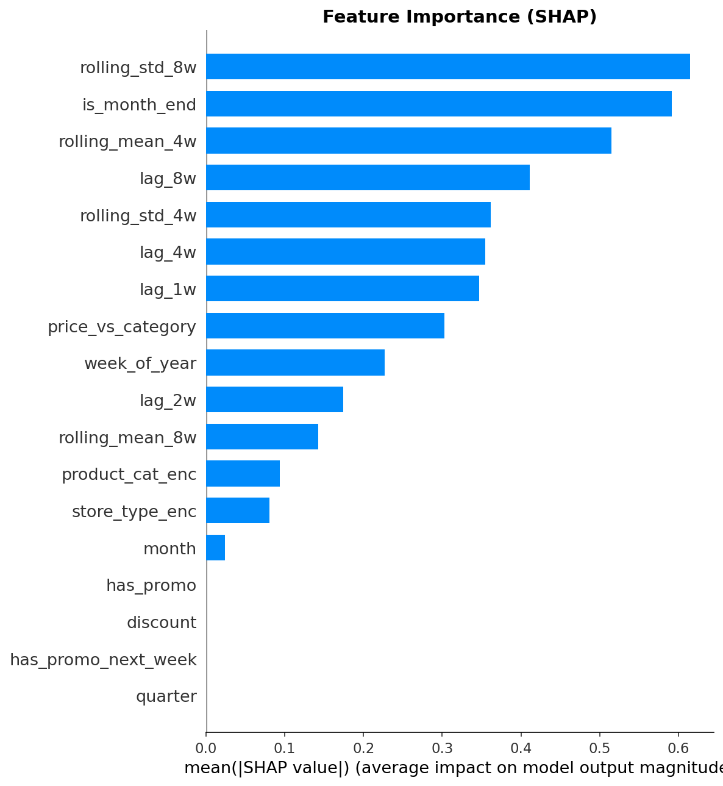

# 🛒 SME Retail DS Solution — Revenue Maximization
 
> Data Science solution สำหรับ SME Retail ที่ต้องการ maximize revenue ผ่าน **Inventory-Demand Co-optimization** — ระบบที่รวม Demand Forecasting, Lead Time Prediction และ Expiry Risk Engine เข้าเป็น pipeline เดียว เพื่อสร้าง actionable PO recommendation และ Streamlit dashboard สำหรับ SME
 
---
 
## 💡 Idea: Inventory-Demand Co-optimization
 
Solution นี้แตกต่างจาก "forecast ธรรมดา" ตรงที่ไม่ได้แค่แสดงกราฟ แต่ **แปลง forecast เป็น action** ที่ลูกค้าทำตามได้เลย
 
```
Demand Forecast (M1)
        ↓
คาด stock ที่จะเหลือ 4 สัปดาห์ข้างหน้า
        ↓
เปรียบเทียบกับ forecasted demand + safety stock
        ↓
Output: suggested PO พร้อม qty + timing + urgency flag
        (คำนวณจาก lead time จริงของแต่ละ supplier)
```
 
| DS ทั่วไป | Solution นี้ |
|---|---|
| "คาดว่าสัปดาห์หน้าขายได้ 70 ลัง" | "สั่ง 30 ลังภายในวันพุธ เพราะ lead time 3 วัน และมีโปรฯ วันศุกร์" |
| Output คือ insight | Output คือ decision |
| ลูกค้าต้องตีความเอง | ลูกค้า approve แล้วดำเนินการได้เลย |
 
---
 
## 📌 Problem Statement
 
| ปัญหา | ผลกระทบ | Solution |
|---|---|---|
| ไม่รู้ demand ล่วงหน้า → สั่งของผิดปริมาณ | Overstock / Stockout | Demand Forecasting (M1) |
| Lead time ของ supplier ไม่แน่นอน | Reorder point คลาดเคลื่อน | Lead Time Model (M2) |
| ไม่มีระบบเตือนของใกล้หมดอายุ | Waste + margin หาย | Expiry Risk Engine (M3) |
 
---
 
## 🔍 EDA Key Findings
 
### 1. Weekly Revenue — Full Year 2024
 

 
- Revenue range ฿5,000–35,000 ต่อสัปดาห์ avg ฿22,000
- เห็น **volatility สูง** ตลอดทั้งปี → demand ไม่ stable → ต้องการ rolling_std เป็น feature (ติด SHAP top 1)
- ช่วง Dec มี drop ชัดเจน → ปลายปี data ยังไม่ครบสัปดาห์
---
 
### 2. Seasonality — Day of Week & Month
 

 
- **Saturday revenue สูงสุด ~฿780** — สูงกว่า Monday ~53%
- **Sunday รองลงมา ~฿670** — ยืนยัน weekend effect ชัดเจน
- **เดือน 6, 8, 12 revenue สูงกว่าเดือนอื่น** — มี seasonal pattern ตาม calendar
- → Feature `week_of_year`, `month`, `is_month_end` จำเป็นสำหรับ model
---
 
### 3. Revenue by Product Category
 

 
| Category | Revenue | สัดส่วน |
|---|---|---|
| dairy | ฿299,039 | 25.4% |
| beverage | ฿264,662 | 22.5% |
| cleaning | ฿249,983 | 21.2% |
| snack | ฿141,360 | 12.0% |
| personal_care | ฿126,585 | 10.7% |
| frozen | ฿97,165 | 8.2% |
 
- **Dairy + Beverage รวมกัน ~48% ของ revenue ทั้งหมด** → category ที่ต้องโฟกัสเป็นพิเศษ
- Frozen revenue ต่ำสุด แต่มี expiry risk สูง → margin เสี่ยงมากถ้า forecast ผิด
---
 
### 4. Promotion Effect — Sweet Spot Problem
 

 
- **Discount 10% และ 25%: qty สูงสุด (~12 units)** แต่ revenue ต่างกันมาก
- **Discount 30%: qty ลดลงเหลือ 6 และ revenue ดิ่งลง ~฿430** — ลด margin มากเกินไปทำให้ลูกค้าไม่ซื้อเพิ่มตามสัดส่วน
- **Sweet spot อยู่ที่ discount 10–15%** ให้ revenue สูงสุดโดยไม่เสีย margin
- → ข้อมูลนี้ support การสร้าง Promotion Uplift module ในอนาคต
---
 
### 5. Lead Time Analysis
 

 
- **Lead time range 3–14 วัน, mean 8.3 วัน** — variation สูงมาก
- **WH01 และ WH02 lead time ใกล้เคียงกัน (~8 วัน), WH03 สูงกว่าเล็กน้อย (~9 วัน)**
- Error bar กว้าง → ทุก warehouse มี inconsistency สูง
- → ถ้าใช้ avg ตายตัว reorder point จะผิดพลาดบ่อย → M2 Lead Time Model จำเป็น
---
 
### 6. Expiry Risk Distribution
 

 
| Status | จำนวน POs |
|---|---|
| Safe | 64 |
| Expired | 34 |
| Warning (<90d) | 17 |
| Critical (<30d) | 5 |
 
- **34 POs หมดอายุแล้ว (28%)** — ไม่มีระบบ alert ทำให้ไม่รู้จนสายเกิน
- **22 POs ต้องดำเนินการด่วน** (Warning + Critical) — ต้องลด price หรือเร่งขาย
- → M3 Expiry Risk Engine มี real business value ชัดเจน
---
 
## 📓 Notebook 02 — Feature Engineering Results
 
**Weekly aggregation:**
 
| Metric | Value |
|---|---|
| Weekly records | 1,795 rows × 6 cols |
| Date range | 2024-01-01 → 2024-12-30 |
| Promo coverage | 1.3% of rows |
 
**Feature matrix:**
 
| Metric | Value |
|---|---|
| Shape | 438 rows × 28 cols |
| Features ที่ใช้ train | 18 features |
| Null values | 0% ทุก feature |
 
**Train / Val / Test Split (time-based):**
 
| Split | Rows | Period |
|---|---|---|
| Train | 163 | 2024-05-06 → 2024-09-30 |
| Val | 66 | 2024-10-07 → 2024-10-28 |
| Test | 209 | 2024-11-04 → 2024-12-30 |
 
---
 
## 📓 Notebook 03 — Model Training Results
 
### M1: Demand Forecasting — LightGBM
 
| Metric | Baseline | LightGBM | Improvement |
|---|---|---|---|
| MAPE (Val) | 116.68% | 93.09% | **+20.2%** |
| MAPE (Test) | 105.97% | 101.56% | +4.2% |
 
> MAPE สูงเนื่องจาก mock data มี sparse demand (qty 1–2 units) — สิ่งสำคัญคือ model ชนะ baseline 20.2%
 
**SHAP — Top 5 Features:**


 
| Feature | Importance | ความหมาย |
|---|---|---|
| `rolling_std_8w` | 0.614 | Demand volatility — สินค้า unstable model ให้ความสำคัญสูง |
| `is_month_end` | 0.591 | Month-end spike ยืนยันจาก EDA |
| `rolling_mean_4w` | 0.515 | Trend ระยะสั้น |
| `lag_8w` | 0.411 | Seasonality 2 เดือน |
| `rolling_std_4w` | 0.362 | Volatility ระยะสั้น |
 
### M2: Lead Time Prediction
 
| Metric | Value | Target |
|---|---|---|
| Test MAE | 3.49 วัน | < 1.5 วัน |
 
> MAE สูงกว่า target เนื่องจาก PO data มีเพียง 120 rows — ใช้ fallback avg 8.28 วัน ในระหว่างนี้
 
---
 
## 📓 Notebook 04 — Co-Optimization Engine Results
 
### Current Stock (ณ 2024-12-23)
 
| Store | Current Stock |
|---|---|
| ST001 | 1,537 |
| ST002 | 1,286 |
| ST003 | 2,114 |
| ST004 | 1,130 |
| ST005 | 1,469 |
| ST006 | **892** ← ต่ำสุด |
 
### Expiry Risk Engine (M3)
 
| Risk | POs | Action |
|---|---|---|
| Expired | มีใน dataset | ดำเนินการทันที |
| High Risk | 76 POs | Markdown 20% |
| Medium Risk | — | Markdown 10% |
 
### PO Recommendations
 
| Store | Product | Suggested Qty | Lead Time | Urgency |
|---|---|---|---|---|
| ST006 | PRD002 | 1 | 7.0 วัน | 🟡 Plan Ahead |
| ST006 | PRD025 | 2 | 8.4 วัน | 🟡 Plan Ahead |
 
---
 
## 📊 Streamlit Dashboard
 
| หน้า | เนื้อหา |
|---|---|
| 📊 Summary | Revenue ฿1.17M, KPI cards, weekly trend, category pie |
| 📦 PO Recommendation | ตาราง color-coded urgency + download CSV |
| 📈 Demand Forecast | Forecast vs Actual + seasonality heatmap |
| ⚠️ Expiry Risk | Risk distribution + PO table |
 
```bash
cd notebooks
streamlit run dashboard.py
```
 
---
 
## 📁 Project Structure
 
```
sme-retail-ds-solution/
├── notebooks/
│   ├── data/
│   │   ├── raw/                      # CSV files (gitignored)
│   │   └── processed/
│   │       ├── feature_store.csv
│   │       └── po_recommendations.csv
│   ├── models/
│   │   ├── model_m1_demand.pkl
│   │   └── model_m2_lead_time.pkl
│   ├── 01_eda.ipynb
│   ├── 02_feature_engineering.ipynb
│   ├── 03_model_training.ipynb
│   ├── 04_co_optimization.ipynb
│   ├── eda_weekly_revenue.png
│   ├── eda_seasonality.png
│   ├── eda_category_revenue.png
│   ├── eda_promo_effect.png
│   ├── eda_lead_time.png
│   ├── eda_expiry_risk.png
│   ├── shap_importance.png
│   ├── forecast_vs_actual.png
│   └── dashboard.py
├── .gitignore
└── README.md
```
 
---
 
## 🗃️ Data Schema (8 Tables)
 
| Table | Rows | Key Columns |
|---|---|---|
| Sales Transaction | 2,000 | datetime, product_id, qty, price, promotion_id, store_id |
| Purchasing Order | 120 | po_date, arrival_date, expire_date, qty, po_price_per_unit |
| Stock Movement | 300 | receive_date, transfer_date, store_id, warehouse_id, qty |
| Product Master | 30 | product_id, price, product_taxonomies |
| Promotion Master | 12 | promotion_id, discount, start_date, end_date |
| Store Master | 6 | store_id, store_taxonomies |
| Customer Master | 200 | customer_id, customer_taxonomies |
| Warehouse Master | 3 | warehouse_id, warehouse_taxonomies |
 
---
 
## 🛠️ Tech Stack
 
| Layer | Tools |
|---|---|
| Data Processing | Python, pandas, numpy |
| ML Models | LightGBM, scikit-learn |
| Explainability | SHAP |
| Experiment Tracking | MLflow |
| Dashboard | Streamlit, Plotly |
| AI Productivity | Claude, GitHub Copilot, Cursor |
 
---
 
## 🚀 Getting Started
 
```cmd
git clone https://github.com/<username>/sme-retail-ds-solution
cd sme-retail-ds-solution
pip install -r requirements.txt
```
 
รัน notebooks ตามลำดับ: `01 → 02 → 03 → 04`
 
```cmd
cd notebooks
streamlit run dashboard.py
```
 
---
 
## 📅 Work Plan
 
| Day | Phase | Output |
|---|---|---|
| 1 | Problem Framing | Problem statement + solution design |
| 2 | EDA | 6 plots + 4 key insights |
| 3 | Feature Engineering | feature_store.csv (438 rows, 18 features) |
| 4 | Model Training | MAPE +20.2% vs baseline + MLflow logs |
| 5 | Co-Optimization Engine | po_recommendations.csv + 76 expiry risk POs |
| 6 | Dashboard | 4-page Streamlit app |
| 7 | Documentation | README + .gitignore + GitHub |
 
---
 
## 🤝 AI in Workflow
 
| Step | Tool | การใช้งาน |
|---|---|---|
| EDA | Claude | วิเคราะห์ schema, suggest anomaly patterns |
| Feature Engineering | GitHub Copilot | Complete pipeline code |
| Model Debug | Claude | อธิบาย SHAP values เชิง business |
| Dashboard | Cursor AI | Streamlit layout + Plotly charts |
| Documentation | Claude | แปลง technical → non-technical |
 
---