# 🛒 SME Retail DS Solution — Revenue Maximization
 
> Data Science solution สำหรับ SME Retail ที่ต้องการ maximize revenue ผ่าน **Inventory-Demand Co-optimization** — ระบบที่รวม Demand Forecasting, Lead Time Prediction และ Expiry Risk Engine เข้าเป็น pipeline เดียว เพื่อสร้าง actionable PO recommendation และ Streamlit dashboard สำหรับ SME
 
---
 
## 💡 Idea: Inventory-Demand Co-optimization
 
Solution นี้แตกต่างจาก "forecast ธรรมดา" ตรงที่ไม่ได้แค่แสดงกราฟ แต่ **แปลง forecast เป็น action** ที่ลูกค้าทำตามได้เลย
 
```
Demand Forecast (M1)
        ↓
คาด stock ที่จะเหลือ 4 สัปดาห์ข้างหน้า
        ↓
เปรียบเทียบกับ forecasted demand + safety stock
        ↓
Output: suggested PO พร้อม qty + timing + urgency flag
        (คำนวณจาก lead time จริงของแต่ละ supplier)
```
 
| DS ทั่วไป | Solution นี้ |
|---|---|
| "คาดว่าสัปดาห์หน้าขายได้ 70 ลัง" | "สั่ง 30 ลังภายในวันพุธ เพราะ lead time 3 วัน และมีโปรฯ วันศุกร์" |
| Output คือ insight | Output คือ decision |
| ลูกค้าต้องตีความเอง | ลูกค้า approve แล้วดำเนินการได้เลย |
 
---
 
## 📌 Problem Statement
 
| ปัญหา | ผลกระทบ | Solution |
|---|---|---|
| ไม่รู้ demand ล่วงหน้า → สั่งของผิดปริมาณ | Overstock / Stockout | Demand Forecasting (M1) |
| Lead time ของ supplier ไม่แน่นอน | Reorder point คลาดเคลื่อน | Lead Time Model (M2) |
| ไม่มีระบบเตือนของใกล้หมดอายุ | Waste + margin หาย | Expiry Risk Engine (M3) |
 
---

### ทำไมถึงเลือก solution นี้

ก่อน EDA คิดถึง 3 ทางหลัก:

**Customer Segmentation + Promotion** — ใช้ `customer_taxonomies` ทำ RFM แล้ว target โปรโมชั่น ดูน่าสนใจแต่ customer data มีแค่ ID กับ segment label ไม่มี behavior จริงๆ และยังไม่รู้ว่า promotion signal ใน data แข็งพอไหม

**Promotion Uplift Modeling** — ใช้ causal ML หา incremental revenue จากโปรโมชั่น เป็น idea ที่ sophisticated แต่ก่อน commit ดู data คร่าวๆ พบว่า promotion master มีแค่ 12 rows และ coverage ใน sales น้อยมาก ถ้า signal น้อยเกินไป uplift model จะ unreliable และ confidence interval กว้างจนไม่มีประโยชน์จริงๆ

**Inventory-Demand Co-optimization (เลือก)** — ดู PO data แล้วเจอ `expire_date`, `arrival_date`, `po_date` ครบ บวกกับ stock movement และ sales ที่บอก demand pattern เหตุผลที่เลือก:

- **data รองรับได้จริง** ไม่ต้อง assume อะไรเพิ่ม
- **business impact วัดได้ชัด** — SME เสียเงินจาก stockout และ waste โดยตรง
- **output เป็น action** — SME ต้องการรู้ว่า "สั่งอะไร เท่าไหร่ เมื่อไหร่" ไม่ใช่แค่ "demand น่าจะเพิ่มขึ้น"
- **ครอบทั้ง supply และ demand side** ในเวลาเดียวกัน"""
 
## 🔍 EDA Key Findings
 
### 1. Weekly Revenue — Full Year 2024
 
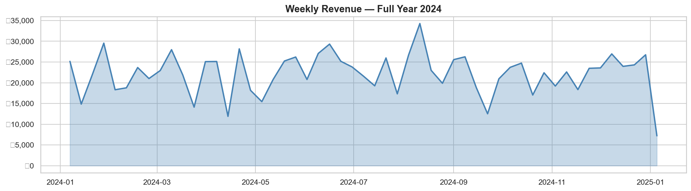
 
- Revenue range ฿5,000–35,000 ต่อสัปดาห์ avg ฿22,000
- เห็น **volatility สูง** ตลอดทั้งปี → demand ไม่ stable → ต้องการ rolling_std เป็น feature (ติด SHAP top 1)
- ช่วง Dec มี drop ชัดเจน → ปลายปี data ยังไม่ครบสัปดาห์
---
 
### 2. Seasonality — Day of Week & Month
 
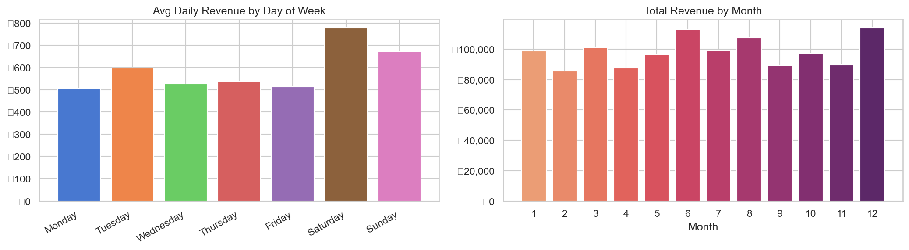
 
- **Saturday revenue สูงสุด ~฿780** — สูงกว่า Monday ~53%
- **Sunday รองลงมา ~฿670** — ยืนยัน weekend effect ชัดเจน
- **เดือน 6, 8, 12 revenue สูงกว่าเดือนอื่น** — มี seasonal pattern ตาม calendar
- → Feature `week_of_year`, `month`, `is_month_end` จำเป็นสำหรับ model
---
 
### 3. Revenue by Product Category
 
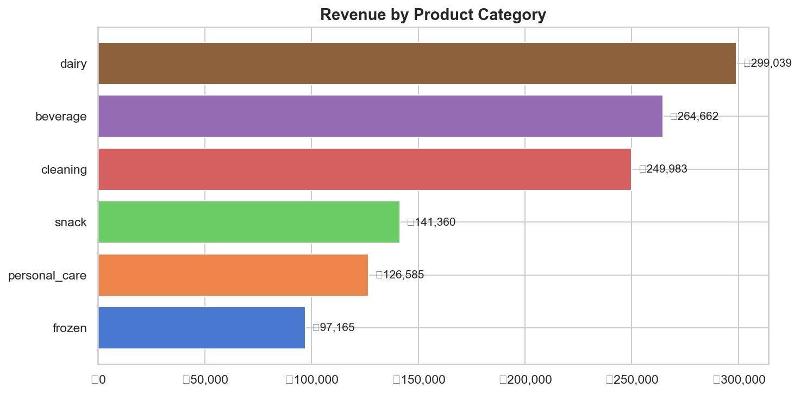
 
| Category | Revenue | สัดส่วน |
|---|---|---|
| dairy | ฿299,039 | 25.4% |
| beverage | ฿264,662 | 22.5% |
| cleaning | ฿249,983 | 21.2% |
| snack | ฿141,360 | 12.0% |
| personal_care | ฿126,585 | 10.7% |
| frozen | ฿97,165 | 8.2% |
 
- **Dairy + Beverage รวมกัน ~48% ของ revenue ทั้งหมด** → category ที่ต้องโฟกัสเป็นพิเศษ
- Frozen revenue ต่ำสุด แต่มี expiry risk สูง → margin เสี่ยงมากถ้า forecast ผิด
---
 
### 4. Promotion Effect — Sweet Spot Problem
 
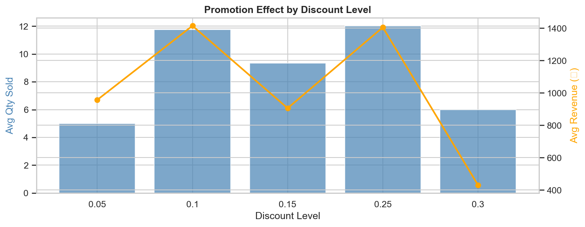
 
- **Discount 10% และ 25%: qty สูงสุด (~12 units)** แต่ revenue ต่างกันมาก
- **Discount 30%: qty ลดลงเหลือ 6 และ revenue ดิ่งลง ~฿430** — ลด margin มากเกินไปทำให้ลูกค้าไม่ซื้อเพิ่มตามสัดส่วน
- **Sweet spot อยู่ที่ discount 10–15%** ให้ revenue สูงสุดโดยไม่เสีย margin
- → ข้อมูลนี้ support การสร้าง Promotion Uplift module ในอนาคต
---
 
### 5. Lead Time Analysis
 
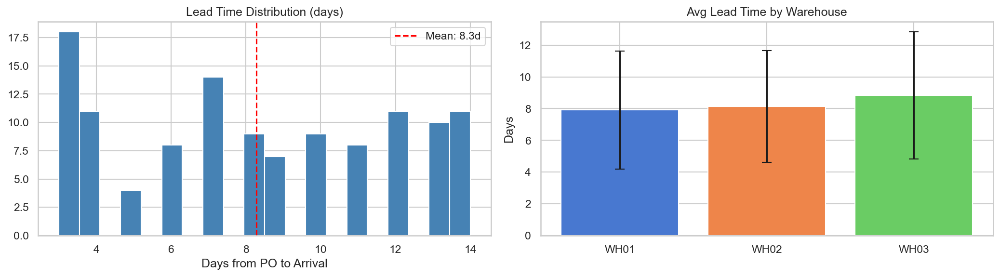
 
- **Lead time range 3–14 วัน, mean 8.3 วัน** — variation สูงมาก
- **WH01 และ WH02 lead time ใกล้เคียงกัน (~8 วัน), WH03 สูงกว่าเล็กน้อย (~9 วัน)**
- Error bar กว้าง → ทุก warehouse มี inconsistency สูง
- → ถ้าใช้ avg ตายตัว reorder point จะผิดพลาดบ่อย → M2 Lead Time Model จำเป็น
---
 
### 6. Expiry Risk Distribution
 
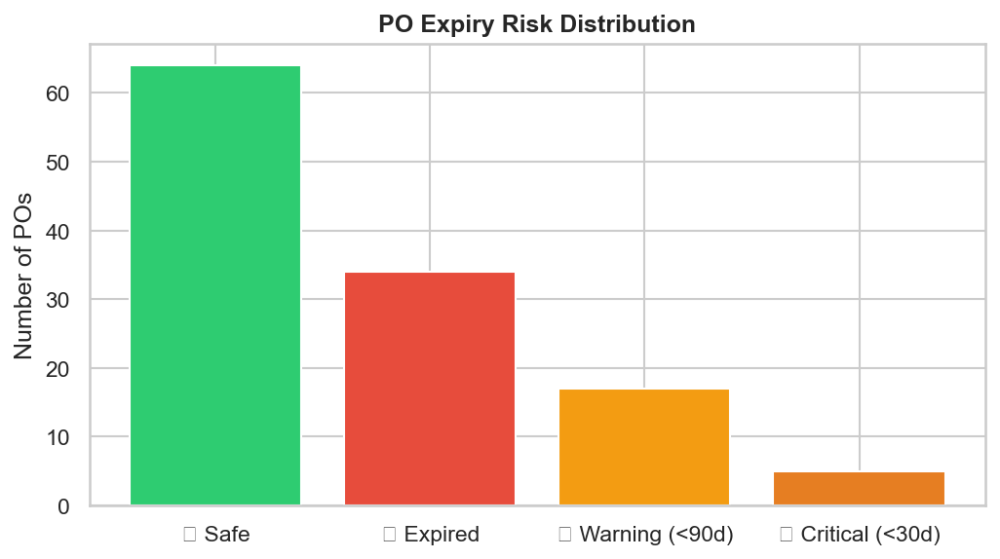
 
| Status | จำนวน POs |
|---|---|
| Safe | 64 |
| Expired | 34 |
| Warning (<90d) | 17 |
| Critical (<30d) | 5 |
 
- **34 POs หมดอายุแล้ว (28%)** — ไม่มีระบบ alert ทำให้ไม่รู้จนสายเกิน
- **22 POs ต้องดำเนินการด่วน** (Warning + Critical) — ต้องลด price หรือเร่งขาย
- → M3 Expiry Risk Engine มี real business value ชัดเจน
---
 
## 📓 Notebook 02 — Feature Engineering Results
 
**Weekly aggregation:**
 
| Metric | Value |
|---|---|
| Weekly records | 1,795 rows × 6 cols |
| Date range | 2024-01-01 → 2024-12-30 |
| Promo coverage | 1.3% of rows |
 
**Feature matrix:**
 
| Metric | Value |
|---|---|
| Shape | 438 rows × 28 cols |
| Features ที่ใช้ train | 18 features |
| Null values | 0% ทุก feature |

หลัง drop rows ที่ lag ยังไม่มีข้อมูล (8 สัปดาห์แรกของแต่ละ group) เหลือ 438 rows พร้อม train โดย null เป็น 0% ทุก feature

**Features ที่ได้ทั้งหมด (18 features):**

| กลุ่ม | Feature | มาจาก | ทำไมถึงสำคัญ |
|---|---|---|---|
| Lag | `lag_1w`, `lag_2w`, `lag_4w`, `lag_8w` | Sales TX | demand สัปดาห์ก่อนหน้า บอก autocorrelation |
| Rolling | `rolling_mean_4w`, `rolling_mean_8w` | Sales TX | trend ระยะสั้นและกลาง |
| Rolling | `rolling_std_4w`, `rolling_std_8w` | Sales TX | demand volatility — **SHAP top 1** |
| Promotion | `has_promo` | Promotion Master | สัปดาห์นี้มีโปรไหม |
| Promotion | `discount` | Promotion Master | ลดกี่เปอร์เซ็นต์ |
| Promotion | `has_promo_next_week` | Promotion Master | สัปดาห์หน้ามีโปรไหม → ต้องสั่งของเพิ่ม |
| Temporal | `week_of_year` | datetime | seasonality รายสัปดาห์ |
| Temporal | `month` | datetime | seasonality รายเดือน |
| Temporal | `quarter` | datetime | seasonality รายไตรมาส |
| Temporal | `is_month_end` | datetime | month-end spike — **SHAP top 2** |
| Context | `product_cat_enc` | Product Master | แต่ละ category มี demand pattern ต่างกัน |
| Context | `store_type_enc` | Store Master | แต่ละ store type ขายต่างกัน |
| Context | `price_vs_category` | Product Master | price elasticity proxy |
 
**Train / Val / Test Split (time-based):**
 
| Split | Rows | Period |
|---|---|---|
| Train | 163 | 2024-05-06 → 2024-09-30 |
| Val | 66 | 2024-10-07 → 2024-10-28 |
| Test | 209 | 2024-11-04 → 2024-12-30 |

**Time-based split** — แบ่ง train/val/test ตาม timeline ไม่ใช่ random เพราะถ้า random จะมีข้อมูลอนาคต leak เข้า train ทำให้ MAPE ดูดีแต่ใช้งานจริงพัง
 
---
 
## 📓 Notebook 03 — Model Training Results

### ทำไมถึงเลือก LightGBM ไม่ใช่ ARIMA, LSTM, หรือ Prophet

ก่อนเลือก model ต้องตอบก่อนว่า problem นี้มีลักษณะยังไง: มี feature หลายมิติ (promotion, store type, seasonality, price) ไม่ใช่แค่ time series อย่างเดียว และ data ต่อ product-store pair มีแค่ ~50 weeks

| Model | ทำไมไม่เลือก |
|---|---|
| **ARIMA** | univariate — จับได้แค่ pattern ของ time series ไม่สามารถใส่ promotion flag หรือ store type เป็น feature ได้ และ sensitive กับ non-stationarity มาก |
| **Prophet** | ดีสำหรับ long-term trend + seasonality แต่ใส่ external features ได้จำกัด และต้องการ data ยาวกว่านี้เพื่อให้ seasonal component reliable |
| **LSTM** | ต้องการ data มากกว่านี้มากสำหรับ time series ต่อ product-store pair และ black box — SME ต้องการรู้ว่า "ทำไม" ไม่ใช่แค่ตัวเลข นอกจากนี้ยังต้องการ GPU และ training นาน |
| **LightGBM (เลือก)** | tabular features (promotion, seasonality, store type) คือ strength ของ tree-based model, interpretable ผ่าน SHAP, fast training บน CPU, robust กับ noisy data, และ SHAP ยืนยันภายหลังว่า feature ที่ engineer มา (`rolling_std_8w`, `is_month_end`) มี impact จริง |
 
### M1: Demand Forecasting — LightGBM
 
| Metric | Baseline | LightGBM | Improvement |
|---|---|---|---|
| MAPE (Val) | 116.68% | 93.09% | **+20.2%** |
| MAPE (Test) | 105.97% | 101.56% | +4.2% |
 
> MAPE สูงเนื่องจาก mock data มี sparse demand (qty 1–2 units) — สิ่งสำคัญคือ model ชนะ baseline 20.2%
 
**SHAP — Top 5 Features:**
 
| Feature | Importance | ความหมาย |
|---|---|---|
| `rolling_std_8w` | 0.614 | Demand volatility — สินค้า unstable model ให้ความสำคัญสูง |
| `is_month_end` | 0.591 | Month-end spike ยืนยันจาก EDA |
| `rolling_mean_4w` | 0.515 | Trend ระยะสั้น |
| `lag_8w` | 0.411 | Seasonality 2 เดือน |
| `rolling_std_4w` | 0.362 | Volatility ระยะสั้น |
 
### M2: Lead Time Prediction
 
| Metric | Value | Target |
|---|---|---|
| Test MAE | 3.49 วัน | < 1.5 วัน |
 
> MAE สูงกว่า target เนื่องจาก PO data มีเพียง 120 rows — ใช้ fallback avg 8.28 วัน ในระหว่างนี้
 
---
 
## 📓 Notebook 04 — Co-Optimization Engine Results
 
### Current Stock (ณ 2024-12-23)
 
| Store | Current Stock |
|---|---|
| ST001 | 1,537 |
| ST002 | 1,286 |
| ST003 | 2,114 |
| ST004 | 1,130 |
| ST005 | 1,469 |
| ST006 | **892** ← ต่ำสุด |
 
### Expiry Risk Engine (M3)
 
| Risk | POs | Action |
|---|---|---|
| Expired | มีใน dataset | ดำเนินการทันที |
| High Risk | 76 POs | Markdown 20% |
| Medium Risk | — | Markdown 10% |
 
### PO Recommendations
 
| Store | Product | Suggested Qty | Lead Time | Urgency |
|---|---|---|---|---|
| ST006 | PRD002 | 1 | 7.0 วัน | 🟡 Plan Ahead |
| ST006 | PRD025 | 2 | 8.4 วัน | 🟡 Plan Ahead |
 
---
 
## 📊 Streamlit Dashboard
 
| หน้า | เนื้อหา |
|---|---|
| 📊 Summary | Revenue ฿1.17M, KPI cards, weekly trend, category pie |
| 📦 PO Recommendation | ตาราง color-coded urgency + download CSV |
| 📈 Demand Forecast | Forecast vs Actual + seasonality heatmap |
| ⚠️ Expiry Risk | Risk distribution + PO table |
 
```bash
cd notebooks
streamlit run dashboard.py
```
 
---

### หน้า 1 — Weekly Intelligence Summary

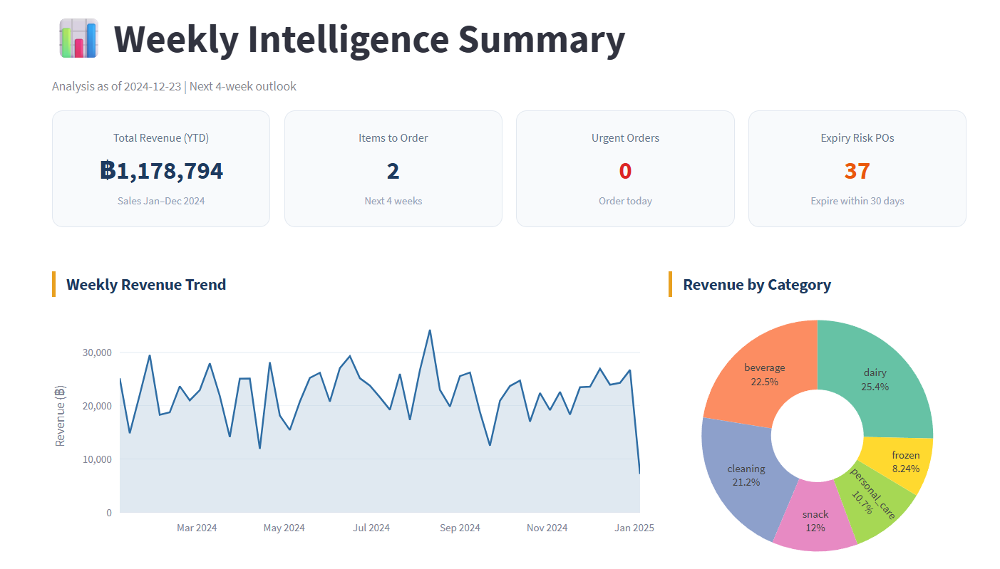

หน้า overview สำหรับผู้บริหารดูทุกเช้าวันจันทร์ แสดง KPI 4 ตัวที่สำคัญที่สุด: total revenue YTD (฿1,178,794), จำนวน items ที่ต้องสั่งสัปดาห์นี้ (2 items), urgent orders ที่ต้องสั่งวันนี้ (0), และ POs ที่เสี่ยงหมดอายุภายใน 30 วัน (37) ด้านล่างมี weekly revenue trend ตลอดปีและ revenue breakdown รายหมวดสินค้า

---

### หน้า 2 — Weekly PO Recommendation

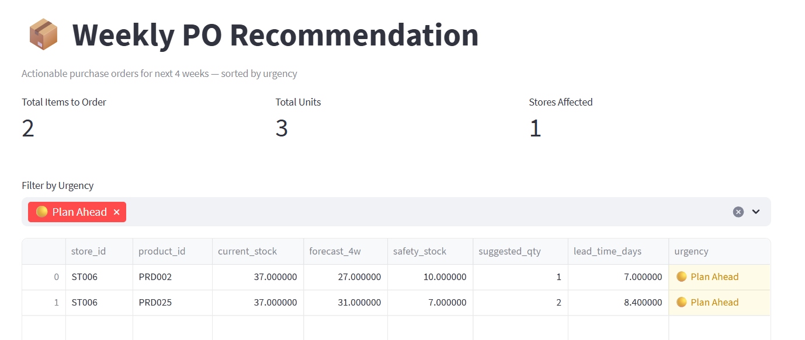

output หลักของทั้ง solution แสดงตารางสินค้าที่ต้องสั่งสัปดาห์นี้ พร้อม current stock, forecast 4 สัปดาห์, safety stock, จำนวนที่แนะนำให้สั่ง, lead time, และ urgency flag color-coded ผู้ใช้งาน filter ตาม urgency ได้และ download เป็น CSV ส่งต่อทีม procurement ได้เลย — ไม่ต้องแปลผล model เอง

---

### หน้า 3 — Demand Forecast

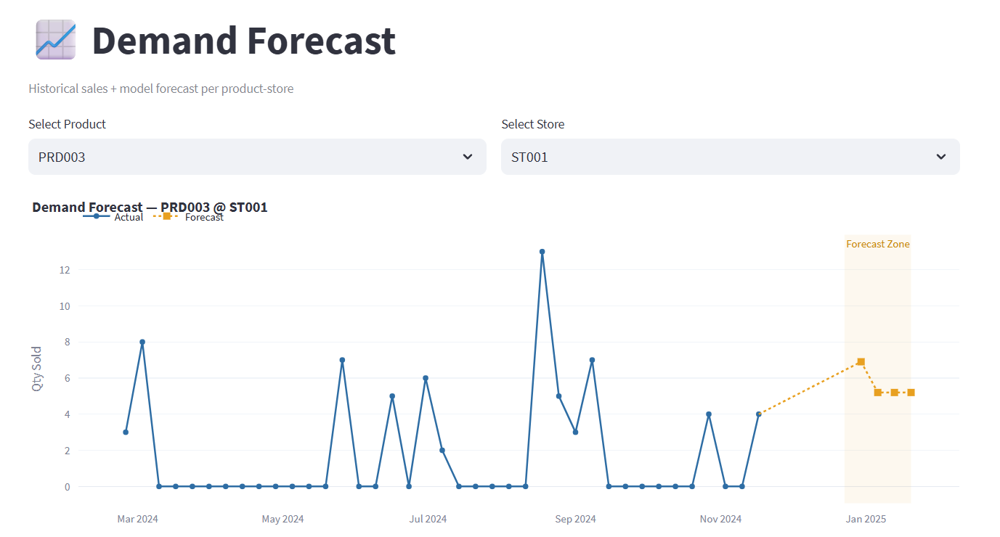

เลือก product และสาขาแล้วดูกราฟ historical sales พร้อม forecast 4 สัปดาห์ข้างหน้า (zone สีเหลือง) เห็นได้ชัดว่า model จับ trend direction ได้ถูก แม้จะ underestimate ช่วง spike เพราะ training data น้อย มี seasonality heatmap ด้านล่างแสดง revenue pattern ตาม day of week และ month

---

### หน้า 4 — Expiry Risk Monitor

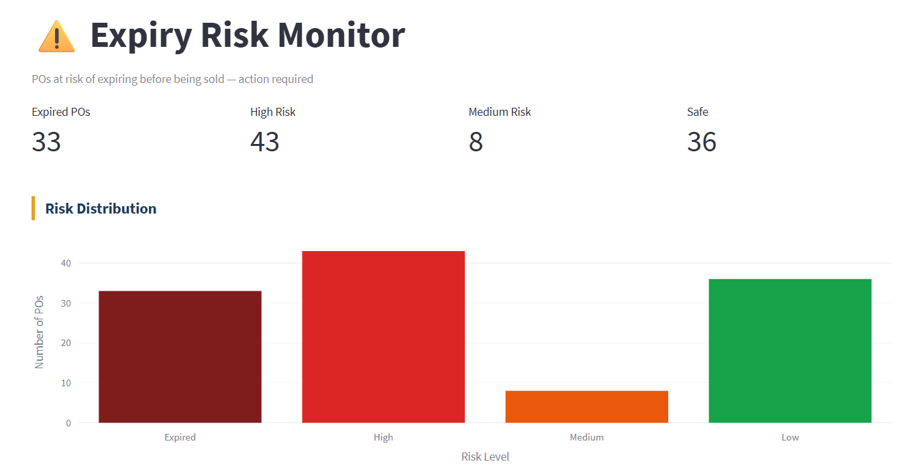

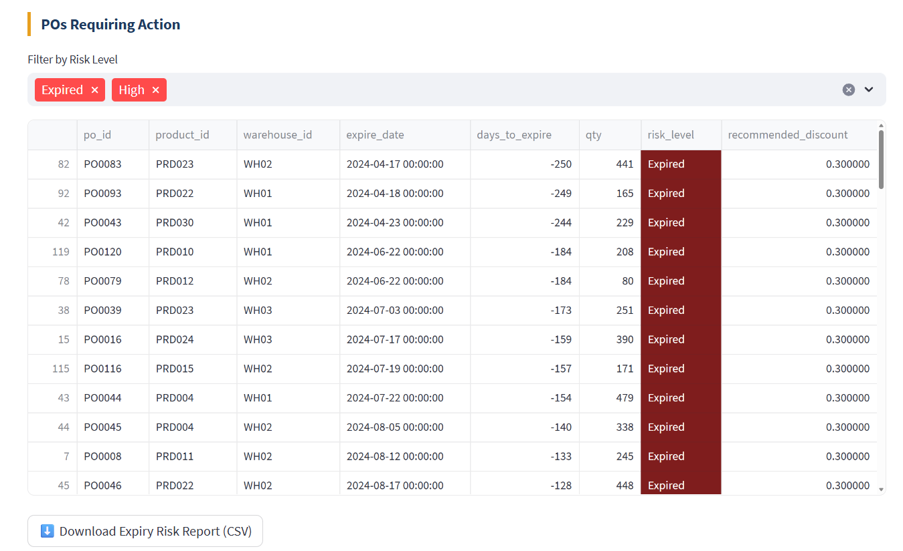

แสดง POs ที่เสี่ยงหมดอายุก่อนขายหมด แบ่งเป็น 4 ระดับ: Expired (33), High Risk (43), Medium Risk (8), Safe (36) ตารางด้านล่าง filter เฉพาะ Expired และ High เพื่อให้ทีมดำเนินการก่อน พร้อม recommended discount ที่คำนวณจาก `days_to_sell vs days_to_expire` และ download report เป็น CSV ได้"""
 
## ⚙️ MLOps Pipeline
 
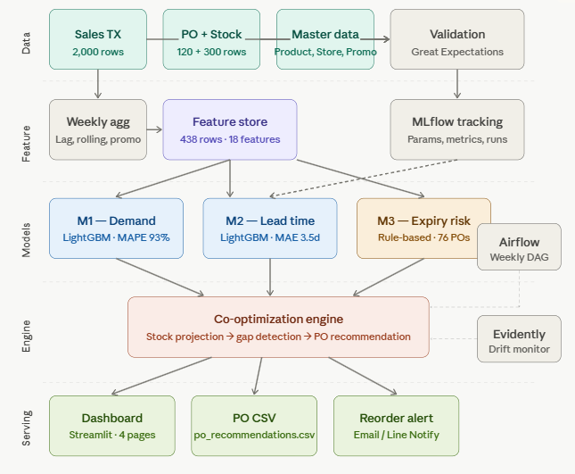
 
Pipeline แบ่งเป็น 5 layers ตามลำดับ:
 
**Data layer** — รับข้อมูลจาก 3 กลุ่มหลัก: Sales TX (2,000 rows), PO + Stock Movement (420 rows), และ Master data ทั้งหมดผ่าน Great Expectations ก่อนเข้า pipeline เพื่อเช็ค null, row count, และ schema
 
**Feature layer** — aggregate sales เป็น weekly level แล้วสร้าง lag, rolling, และ promo features รวม 18 features บันทึกเป็น feature store (438 rows) ทุก experiment track ผ่าน MLflow
 
**Model layer** — train 3 models แยกกัน: M1 LightGBM demand forecast (MAPE 93%, +20.2% vs baseline), M2 LightGBM lead time prediction (MAE 3.5d), และ M3 rule-based expiry risk engine (76 POs flagged) โดย Airflow DAG trigger retraining ถ้า model เก่าเกิน 35 วัน
 
**Co-optimization engine** — core ของ solution รวม output จากทั้ง 3 models เข้าด้วยกัน: project stock 4 สัปดาห์, detect gap, คำนวณ safety stock และ generate PO recommendation พร้อม urgency flag โดย Evidently AI monitor data drift แบบ weekly
 
**Serving layer** — output 3 ช่องทาง: Streamlit dashboard 4 หน้า, PO CSV สำหรับ download, และ Email/Line Notify สำหรับ urgent items เท่านั้น
 
---
 
## 📁 Project Structure
 
```
sme-retail-ds-solution/
│
├── notebooks/
│   ├── data/
│   │   ├── raw/                        # CSV files (gitignored)
│   │   └── processed/
│   │       ├── feature_store.csv
│   │       └── po_recommendations.csv
│   ├── models/
│   │   ├── model_m1_demand.pkl
│   │   └── model_m2_lead_time.pkl
│   ├── dags/
│   │   └── weekly_forecast_dag.py      # Airflow DAG — รันทุกอาทิตย์ 23:00
│   ├── mlruns/                         # MLflow experiment logs (gitignored)
│   ├── 01_eda.ipynb
│   ├── 02_feature_engineering.ipynb
│   ├── 03_model_training.ipynb
│   ├── 04_co_optimization.ipynb
│   ├── inference_pipeline.py           # Batch inference script
│   ├── dashboard.py                    # Streamlit dashboard
│   ├── mlops_pipeline.png
│   ├── shap_importance.png
│   ├── forecast_vs_actual.png
│   └── eda_*.png
│
├── docker-compose.yml                  # Airflow + PostgreSQL
├── requirements.txt
├── .gitignore
└── README.md
```
 
---

## 🐳 Docker Setup (Airflow)

Pipeline orchestration ใช้ Airflow รันผ่าน Docker ไม่ต้อง install ลงเครื่องโดยตรง

```cmd
# ครั้งแรก — init database และ create user
docker-compose up airflow-init

# รัน Airflow
docker-compose up -d

# เปิด Airflow UI
# http://localhost:8080
# user: airflow / pass: airflow
```

DAG `weekly_forecast_pipeline` จะขึ้นใน UI อัตโนมัติ schedule รันทุกวันอาทิตย์ 23:00 หรือ trigger manual ได้เลย

**Services ที่รันใน Docker:**

| Service | Port | หน้าที่ |
|---|---|---|
| airflow-webserver | 8080 | UI สำหรับ monitor DAG |
| airflow-scheduler | — | trigger task ตาม schedule |
| postgres | 5432 | Airflow metadata database |"""

 
## 🗃️ Data Schema (8 Tables)
 
| Table | Rows | Key Columns |
|---|---|---|
| Sales Transaction | 2,000 | datetime, product_id, qty, price, promotion_id, store_id |
| Purchasing Order | 120 | po_date, arrival_date, expire_date, qty, po_price_per_unit |
| Stock Movement | 300 | receive_date, transfer_date, store_id, warehouse_id, qty |
| Product Master | 30 | product_id, price, product_taxonomies |
| Promotion Master | 12 | promotion_id, discount, start_date, end_date |
| Store Master | 6 | store_id, store_taxonomies |
| Customer Master | 200 | customer_id, customer_taxonomies |
| Warehouse Master | 3 | warehouse_id, warehouse_taxonomies |
 
---
 
## 🛠️ Tech Stack
 
| Layer | Tools |
|---|---|
| Data Processing | Python, pandas, numpy |
| ML Models | LightGBM, scikit-learn |
| Explainability | SHAP |
| Experiment Tracking | MLflow |
| Dashboard | Streamlit, Plotly |
| AI Productivity | Claude, GitHub Copilot, Cursor |
 
---
 
## 🚀 Getting Started
 
```cmd
git clone https://github.com/<username>/sme-retail-ds-solution
cd sme-retail-ds-solution
pip install -r requirements.txt
```
 
รัน notebooks ตามลำดับ: `01 → 02 → 03 → 04`
 
```cmd
cd notebooks
streamlit run dashboard.py
```
 
---
 
## 📅 Work Plan
 
| Day | Phase | Output |
|---|---|---|
| 1 | Problem Framing | Problem statement + solution design |
| 2 | EDA | 6 plots + 4 key insights |
| 3 | Feature Engineering | feature_store.csv (438 rows, 18 features) |
| 4 | Model Training | MAPE +20.2% vs baseline + MLflow logs |
| 5 | Co-Optimization Engine | po_recommendations.csv + 76 expiry risk POs |
| 6 | Dashboard | 4-page Streamlit app |
| 7 | Documentation | README + .gitignore + GitHub |
 
---
 
## 🤝 AI in Workflow
 
| Step | Tool | การใช้งาน |
|---|---|---|
| EDA | Claude | วิเคราะห์ schema, suggest anomaly patterns |
| Feature Engineering | GitHub Copilot | Complete pipeline code |
| Model Debug | Claude | อธิบาย SHAP values เชิง business |
| Dashboard | Cursor AI | Streamlit layout + Plotly charts |
| Documentation | Claude | แปลง technical → non-technical |
 
---